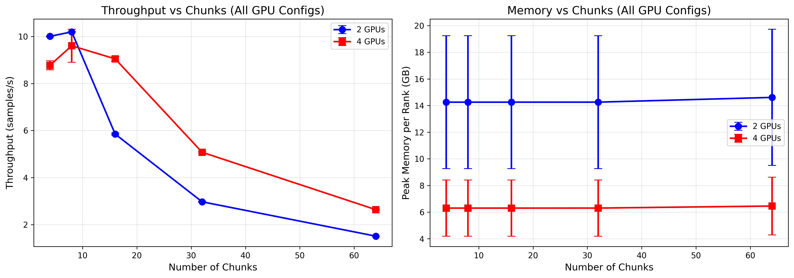
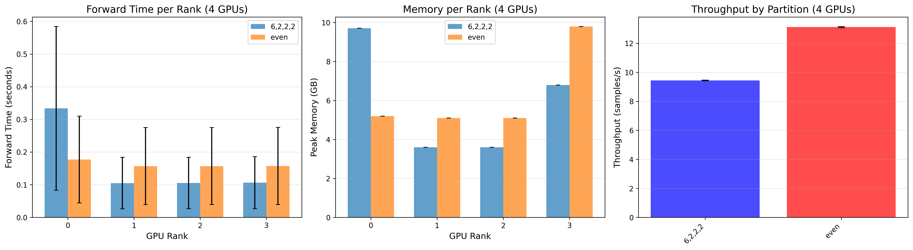

# Lab 3

Saad Amin

## Task 1


It appears PACE gave me 8 GPUs even though I asked only for 4. 

What this means is that:
- GPUs are connected using NVLink, which means they should have (relatively) fast memory access between each other.
- We have 2 NUMA nodes, and GPUs0-3 are wired via PCIe to node 0 and GPUs4-7 are wired to node 1

## Task 2

```
Running time for broadcast1: 1.3572168946266174 (s)
Running time for broadcast2: 0.3723844289779663 (s)
Running time for broadcast3: 0.07500745356082916 (s)
```

Modifications made to code:
- Timing data is the average of 16 runs to get more accurate data

Design choices:
- Host tensor `a` is allocated using `pin_memory=True` instead. 
- All transfers use `non_blocking=True`
- All transfers happen on their own streams
- Transfers from `x` -> `a` -> other GPUs have been pipelined 
    - We transfer contigous blocks from `x` to `a`, wait for it to finish, and then start the transfer of that block to other GPUs while we transfer the next block to `a`

## Task 3

### Deliverable 1

```
BertModel(
  (embeddings): BertEmbeddings(
    (word_embeddings): Embedding(30522, 768, padding_idx=0)
    (position_embeddings): Embedding(512, 768)
    (token_type_embeddings): Embedding(2, 768)
    (LayerNorm): LayerNorm((768,), eps=1e-12, elementwise_affine=True)
    (dropout): Dropout(p=0.1, inplace=False)
  )
  (encoder): BertEncoder(
    (layer): ModuleList(
      (0-11): 12 x BertLayer(
        (attention): BertAttention(
          (self): BertSdpaSelfAttention(
            (query): Linear(in_features=768, out_features=768, bias=True)
            (key): Linear(in_features=768, out_features=768, bias=True)
            (value): Linear(in_features=768, out_features=768, bias=True)
            (dropout): Dropout(p=0.1, inplace=False)
          )
          (output): BertSelfOutput(
            (dense): Linear(in_features=768, out_features=768, bias=True)
            (LayerNorm): LayerNorm((768,), eps=1e-12, elementwise_affine=True)
            (dropout): Dropout(p=0.1, inplace=False)
          )
        )
        (intermediate): BertIntermediate(
          (dense): Linear(in_features=768, out_features=3072, bias=True)
          (intermediate_act_fn): GELUActivation()
        )
        (output): BertOutput(
          (dense): Linear(in_features=3072, out_features=768, bias=True)
          (LayerNorm): LayerNorm((768,), eps=1e-12, elementwise_affine=True)
          (dropout): Dropout(p=0.1, inplace=False)
        )
      )
    )
  )
  (pooler): BertPooler(
    (dense): Linear(in_features=768, out_features=768, bias=True)
    (activation): Tanh()
  )
)
BertConfig {
  "_attn_implementation_autoset": true,
  "attention_probs_dropout_prob": 0.1,
  "classifier_dropout": null,
  "hidden_act": "gelu",
  "hidden_dropout_prob": 0.1,
  "hidden_size": 768,
  "initializer_range": 0.02,
  "intermediate_size": 3072,
  "layer_norm_eps": 1e-12,
  "max_position_embeddings": 512,
  "model_type": "bert",
  "num_attention_heads": 12,
  "num_hidden_layers": 12,
  "pad_token_id": 0,
  "position_embedding_type": "absolute",
  "return_dict": false,
  "transformers_version": "4.49.0",
  "type_vocab_size": 2,
  "use_cache": true,
  "vocab_size": 30522
}

Total params ≈ 109M
================================================================================
DELIVERABLE 1: Baseline
================================================================================

Configuration  # GPUs Throughput (samples/s) Peak Memory per Rank (GB)
       4_GPUs       4          9.233 ± 0.598             6.300 ± 2.109

================================================================================
```

### Deliverable 2

```
================================================================================
DELIVERABLE 2: GPU Configuration Comparison
================================================================================

Configuration  # GPUs Throughput (samples/s) Peak Memory per Rank (GB)
       3_GPUs       3         12.366 ± 0.006             8.702 ± 3.075
       4_GPUs       4          9.233 ± 0.598             6.300 ± 2.109

================================================================================
```

The data shows that although 4 GPUs has lower memory usage (because model weights are distributed over more GPUs) it actually has worse performance. I think it is due to pipeline overhead:

- Global batch size is 64
- Number of chunks is 4
- That means we only have one time step when the pipeline is full saturated.

Please see the next deliverable for evidence.

### Deliverable 3



- The data covers a global batch size of 64 and chunk counts of 4, 8, 16, 32, and 64
- We would expect 4 GPUs to have more throughput than 2 GPUs, and the data confirms this for larger number of chunks
- However, as mentioned in the previous section, having fewer chunks can result in irregular results if the pipeline is not saturated or if overhead has a large impact.
    - This is best shown in 4 and 8 chunks, where 2 GPUs actually outperforms 4 GPUs.
    - This is also why for both configurations, increasing the chunk count increases throughput (the initial latency from the pipeline not being saturated matters less and less).
- Also important to mention: although in larger chunk counts 4 GPUs does outperform 2 GPUs, performance decreases for both
    - This is likely due to pipeline overhead
    - Smaller chunks means that each pipeline stage takes less time
    - As a result, actions that on average have a fixed cost (like transferring data from one stage to another) start to dominate

### Deliverable 4



- A slow stage in the pipeline end up leaving faster stages that come afterwards waiting on inputs to arrive.
- This leads to underutilization and worse throughput.

## Task 4

Seeds used for both: 1, 2, 3

DDP results for global batch size = 64:

```
Aggregate: {
  "throughput_mean": 111.16570593892513,
  "throughput_std": 0.12228515652003448,
  "time_per_step_mean": 0.5757178155581156,
  "time_per_step_std": 0.0006328498033082033,
  "mem_peak_per_rank_mean_bytes": [
    38312673450.666664,
    38312673450.666664,
    38312673450.666664,
    38312673450.666664
  ],
  "mem_peak_per_rank_std_bytes": [
    247151.73339648842,
    247151.73339648842,
    247151.73339648842,
    247151.73339648842
  ]
}
```

FSDP results for global batch size = 64:

```
Aggregate: {
  "throughput_mean": 102.94562546599454,
  "throughput_std": 11.785863109064842,
  "time_per_step_mean": 0.6306810474395752,
  "time_per_step_std": 0.07855699593537264,
  "mem_peak_per_rank_mean_bytes": [
    37545608704.0,
    37545600512.0,
    37545600512.0,
    37546165760.0
  ],
  "mem_peak_per_rank_std_bytes": [
    178843529.87828666,
    178836841.1382957,
    178836841.1382957,
    178811758.94974294
  ]
}
```

At first, this data appeared unexpected (I was thinking we'd see a much bigger memory usage difference between FSDP and DDP). I reran teh tests with global batch size = 16

DDP results for global batch size = 16:

```
Aggregate: {
  "throughput_mean": 103.07518594170095,
  "throughput_std": 0.31990644738058055,
  "time_per_step_mean": 0.15522798935572307,
  "time_per_step_std": 0.00048097297912959736,
  "mem_peak_per_rank_mean_bytes": [
    10945447594.666666,
    10945360213.333334,
    10945447594.666666,
    10944776362.666666
  ],
  "mem_peak_per_rank_std_bytes": [
    975609.2788479526,
    1006087.1943197678,
    975609.2788479526,
    265663.4852105615
  ]
}
```

FSDP results for global batch size = 16:

```
Aggregate: {
  "throughput_mean": 102.32684753229941,
  "throughput_std": 0.2678426755018219,
  "time_per_step_mean": 0.15636277198791504,
  "time_per_step_std": 0.0004089306595197579,
  "mem_peak_per_rank_mean_bytes": [
    10176927232.0,
    10176919040.0,
    10176919040.0,
    10176919040.0
  ],
  "mem_peak_per_rank_std_bytes": [
    178843529.87828666,
    178836841.1382957,
    178836841.1382957,
    178836841.1382957
  ]
}
```
Anaylsis:
- In both cases, FSDP uses about 700 MB of memory less. 
- This is most likely the savings from full sharding the model.
- However in both DDP and FSDP we are using gigabytes of memory. 
    - This is most likely due to the activation tensors kept during the forwards pass and saved for the backwards pass.
    - Using one-fourth the batch size led to nearly one-fourth the memory. 
    - In both DDP and FSDP, each GPU stores the non-sharded batch, which explains why we don't see a one-fourth memory saving.
- According to the data, FSDP has slightly lower throughput
    - This is most likely due to the additional communication involved
- I would recommend DDP for this model as it is only 109 MB parameters and DDP is less complex and faster (no inter-GPU communication)
    - Furthermore, the main source of memory usage is activation tensors
    - Would recommend gradient accumulation


