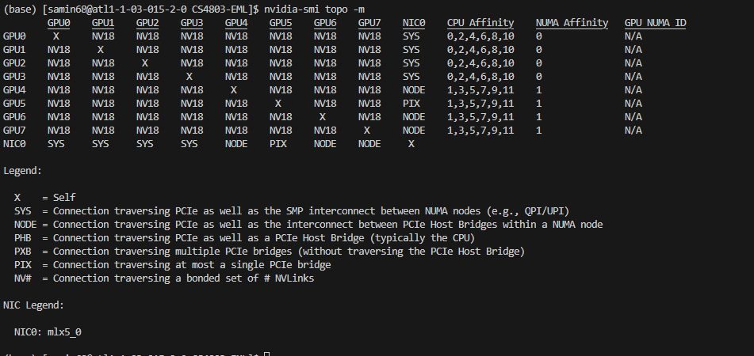

# Lab 3

Saad Amin

## Task 1



It appears PACE gave me 8 GPUs even though I asked only for 4. 

What this means is that:
- GPUs are connected using NVLink, which means they should have (relatively) fast memory access between each other.
- We have 2 NUMA nodes, and GPUs0-3 are wired via PCIe to node 0 and GPUs4-7 are wired to node 1

## Task 2

```
Running time for broadcast1: 1.3572168946266174 (s)
Running time for broadcast2: 0.3723844289779663 (s)
Running time for broadcast3: 0.07500745356082916 (s)
```

Modifications made to code:
- Timing data is the average of 16 runs to get more accurate data

Design choices:
- Host tensor `a` is allocated using `pin_memory=True` instead. 
- All transfers use `non_blocking=True`
- All transfers happen on their own streams
- Transfers from `x` -> `a` -> other GPUs have been pipelined 
    - We transfer contigous blocks from `x` to `a`, wait for it to finish, and then start the transfer of that block to other GPUs while we transfer the next block to `a`